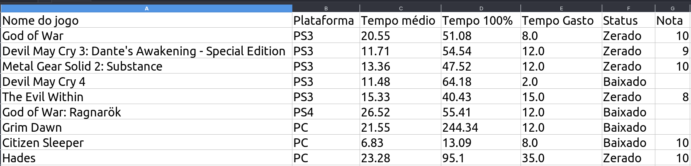

# Consumo de api How Long to Beat

Usuario informa:
- nome dos jogos
- plataforma
- estado: `{Em espera, Baixado, Zerado}`
- tempo gasto
- Nota do jogo(opcional)

Sistema busca na API:
- Tempo médio para zerar o jogo
- Tempo médio para o 100% do jogo

`Vai gerar um csv com essas informações`
### Exemplo:

[Arquivo de exemplo](./csv/example.csv)

## Dependencias:

- [API How Long to Beat](https://github.com/ScrappyCocco/HowLongToBeat-PythonAPI)

- [Pandas](https://pandas.pydata.org/)

- [Path](https://docs.python.org/3/library/os.path.html)
